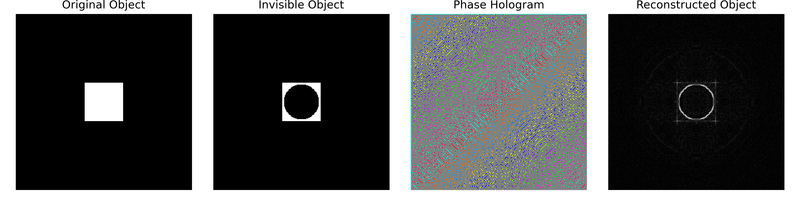
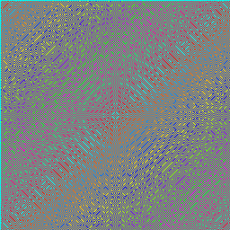

# 🌀 Phase-Only Holographic Reconstruction: Optical Camouflage Simulation

Optical camouflage and digital holography represent two distinct yet complementary approaches to manipulating light for concealment and recovery. While camouflage aims to suppress the visibility of an object through spatial masking or refractive redirection, holography enables the reconstruction of wavefronts from encoded phase or intensity patterns. This project explores the intersection of these paradigms by simulating the recovery of a camouflaged object using phase-only holographic reconstruction.
The simulation begins with a simple binary object, a white square on a dark background into which a circular region is embedded to simulate optical invisibility. This region acts as a refractive mask, suppressing the object’s amplitude within its bounds. The modified object field is then transformed via a Fourier-based holographic encoding, capturing only the phase information of the resulting complex wavefront.
Reconstruction is performed by synthesizing a phase-only hologram and applying an inverse Fourier transform to recover the object’s spatial structure. Despite the absence of amplitude information, the reconstruction reveals the original object with surprising fidelity, demonstrating the power of phase encoding in wavefront recovery. The simulation visualizes four key stages: the original object, the camouflaged field, the phase hologram, and the reconstructed image.
This work highlights the potential of phase-only holography as a tool for recovering suppressed or hidden information in optical systems. It reflects foundational principles of wave optics, Fourier analysis, and inverse imaging, and offers a compelling framework for educational demonstrations and research in computational imaging, holographic encryption, and refractive concealment.

## 📌 Overview
This project demonstrates how phase-only holography can be used to reconstruct an object that has been visually suppressed or camouflaged. A binary object (white square) is masked by a circular region to simulate invisibility. The modified field is encoded using a Fourier transform, and only the phase information is retained. The object is then reconstructed using an inverse Fourier transform, revealing hidden structure through phase recovery.

## 🧠 Physics Context
- **Optical Camouflage**: Simulates a refractive region that suppresses object visibility.
- **Phase-Only Holography**: Encodes object information using only the phase of the Fourier transform.
- **Inverse Imaging**: Recovers spatial structure from phase data via inverse Fourier transform.
- **Wavefront Recovery**: Demonstrates how phase carries essential structural information.

## 🚀 Features
- Simulates a binary object with a circular “invisible” region.
- Computes phase-only hologram using FFT.
- Reconstructs object using inverse FFT of phase-only data.
- Visualizes all stages: original object, camouflaged field, phase hologram, and reconstruction.
- Saves final panel and phase hologram for documentation or presentation.

## 🎯 Educational & Research Value
## Ideal for:
• 	Teaching the role of phase in wavefront encoding.

• 	Demonstrating holographic reconstruction from incomplete data.

• 	Exploring optical concealment and recovery techniques.

## 👤 Author
Developed by Fuseini — researcher in computational optics, holography, and scientific visualization.
## 📄 License
MIT License.
